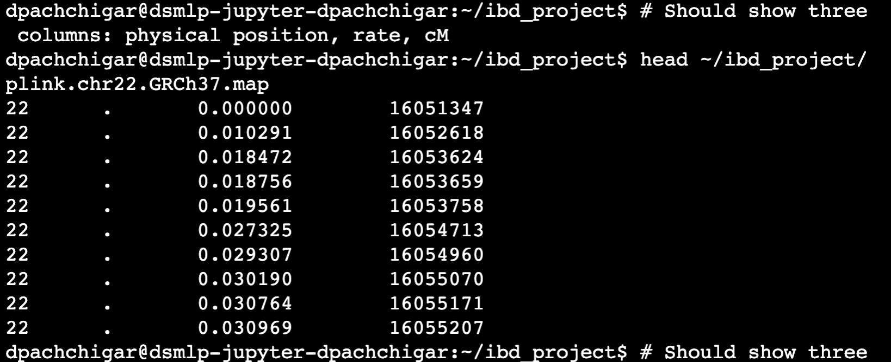
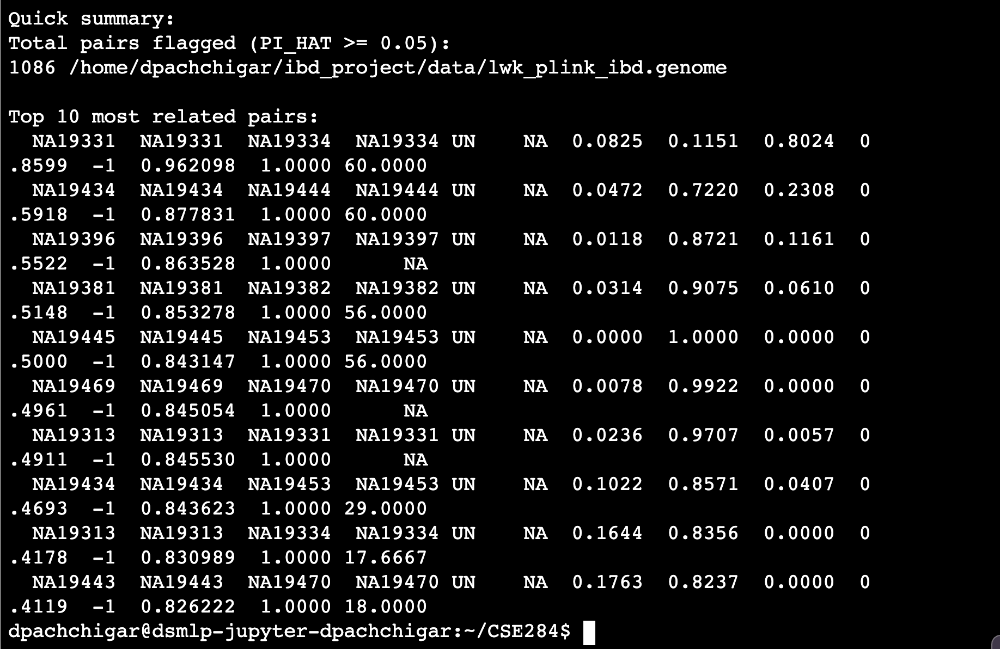

# CSE 284: PLINK vs. GERMLINE: IBD-Based Relatedness Detection

**Team Members:** Dhaivat Pachchigar, Harsh Sharma, Sharanya Ranka

## Project Overview

We have decided to work on option 2 where we are doing an analysis project comparing Plink and Germline for detecting IBD and inferring relatedness between individuals:

- **PLINK** (`--genome`): Produces pairwise relatedness statistics (We used this in ps2), most importantly PI_HAT, which estimates the overall proportion of the genome shared IBD between two individuals, it use pi_hat to find how closely related 2 individuals are.
- **GERMLINE**: A segment-based IBD detection tool that identifies shared haplotype segments between pairs of individuals

The goal is not to declare one tool better than the other but to characterize where they agree and disagree, understand the reasons behind disagreements, and identify the practical strengths and weaknesses of each approach.
Another note, we are also not trying to predict how two individuals are related, since individuals can have the same IBDs but their relationship would be different.

---

## Dataset

We use the LWK (Luhya from Kenya) population subset from the 1000 Genomes Project, preprocessed into PLINK binary format. The dataset is mainly the ps2 dataset we already used. We use this dataset because the 1000genome dataset doesn't have relationship among indiviuals. Though the current dataset doesn't have any official relationship, our findings using Plinnk were interesting. 

**Files (on datahub at `~/public/ps2/ibd/`):**
- `ps2_ibd.lwk.bed`
- `ps2_ibd.lwk.bim`
- `ps2_ibd.lwk.fam`

To keep compute manageable, all analyses are scoped to **chromosome 22**. We used this because it's used for benchmarking many tools in bioinformatics.  

---

## Repository Structure


---

## How to Run

This can only be run on datahub since the tools needed to replicate what we did are all available on datahub and writing installation for each
would be a pain since, it cannot be assumed that the person running will be using the same OS as us. 

### Step 0: installations
## Sanity check to make sure all files exists
```
which gcc        # C++ compiler needed to build GERMLINE
which java       # Java needed for BEAGLE
which plink      # PLINK needed for data conversion
gcc --version    # Should be gcc 9.x or later
java -version    # Should be OpenJDK 11 or later
plink --version  # Should be PLINK v1.90
```

1. First clone the repo
```
cd ~
git clone https://github.com/devPach4545/CSE284.git
cd CSE284
```


- now create an output directory this is where all the output will be stored irreepctive of where the repo is cloned:
```
mkdir -p ~/ibd_project/data
```

- Install germline

```
cd ~
git clone https://github.com/gusevlab/germline.git ~/GERMLINE
cd ~/GERMLINE
make
```

- In order to phase data, we download beagle

```
wget https://faculty.washington.edu/browning/beagle/beagle.22Jul22.46e.jar \
    -O ~/ibd_project/beagle.jar
```

- verify it downloaded

```
ls -lh ~/ibd_project/beagle.jar # should show around 295KB
```

- So we learned that need a genetic map of chr 22 in order to get correct genetic distances otherwise germline will assume 1 cM = 1Mb

```
wget https://bochet.gcc.biostat.washington.edu/beagle/genetic_maps/plink.GRCh37.map.zip \
    -O ~/ibd_project/genetic_map.zip
cd ~/ibd_project
unzip genetic_map.zip
cd ~
```

- verify it has chr 22

```
head ~/ibd_project/plink.chr22.GRCh37.map

```


- Now, time to run preprocessing script


```
cd ~/CSE284
bash scripts/preprocess.sh
```

- this will generate some .bed file

- Okay, we are ready to run plink
```
bash scripts/run_plink.sh
```

- You should see the outlike this below


## Good job if you made it so far,
Now, we will have to prepare to run germline. If you have installed everything we wrote above, 
you just need to run 

```
bash scripts/run_germline.sh
```


## Results So Far (Can be found in ibd_project/data folder)

### Preprocessing (Complete)
- Started with 13,595 SNPs on chromosome 22 across 97 LWK individuals
- After QC filters: removed 3 variants (HWE), 980 variants (MAF < 0.01), 0 samples
- After LD pruning: 4,195 independent SNPs remaining across 97 individuals
- Final dataset: `lwk_chr22_pruned.bed/bim/fam`

### PLINK IBD Estimation (Complete)
- Ran `plink --genome` on the pruned chr22 dataset
- With threshold PI_HAT >= 0.05: **1,085 pairs flagged**
- Despite 1000 Genomes claiming no related individuals, PLINK detected **cryptic relatedness** in several pairs

**Top related pairs found:**

| Pair | PI_HAT | Z0 | Z1 | Z2 | Inferred Relationship |
|---|---|---|---|---|---|
| NA19331 / NA19334 | 0.86 | 0.08 | 0.12 | 0.80 | Full siblings or twins |
| NA19434 / NA19444 | 0.59 | 0.05 | 0.72 | 0.23 | Full siblings |
| NA19396 / NA19397 | 0.55 | 0.01 | 0.87 | 0.12 | Parent-child |
| NA19381 / NA19382 | 0.51 | 0.03 | 0.91 | 0.06 | Parent-child |
| NA19445 / NA19453 | 0.50 | 0.00 | 1.00 | 0.00 | Parent-child (classic Z1=1) |

**Key observation:** Z0/Z1/Z2 patterns are highly informative for distinguishing relationship types even before comparing with GERMLINE. Parent-child pairs show Z1 dominant (~1.0), while sibling pairs show high Z2. So, this dataset may have related indiviuals. 


- To be completed by teammate
- Will produce % shared IBD length per pair for direct comparison with PI_HAT
- SO THIS ONE IS NOT INSTALLED ON DATAHUB, WE ARE WORKING TO GET IT INSTALLED AND RUN IT


### Step 4: Analysis and Visualization
Open and run `notebooks/analyze.ipynb` to reproduce all figures and comparisons.

---

## Evaluation Plan

### Lower-Level Metric Comparison
- Compute % shared IBD length from GERMLINE output (normalized to chr22 length)
- Correlate PI_HAT (PLINK) vs % shared IBD length (GERMLINE) using Pearson and Spearman correlation
- Scatter plot of the two metrics across all pairs

### Relationship Degree Binning
Bin each flagged pair into a relationship category based on expected IBD values:

| Relationship | Expected PI_HAT | Expected % IBD |
|---|---|---|
| Parent-Child / Full Siblings | ~0.50 | ~50% |
| Half Siblings / Grandparent | ~0.25 | ~25% |
| First Cousins | ~0.125 | ~12.5% |
| Unrelated | ~0 | ~0% |

Compare whether both tools assign the same relationship degree to the same pairs.

### Cluster-Level Comparison
Rather than only comparing pairs, cluster related individuals into family-like groups using each tool's output independently, then compare cluster structure between tools.

### Parameter Sensitivity
Vary PI_HAT thresholds (PLINK) and minimum segment length (GERMLINE) to measure how sensitive each tool's calls are to parameter choices.

### Performance Benchmarking
Record runtime and peak memory usage for both tools on chr22.

---

## Results So Far

- [x] Preprocessing pipeline complete
- [x] PLINK run complete
- [ ] GERMLINE run complete
- [ ] Correlation analysis complete
- [ ] Cluster comparison complete

*(This section will be updated as results come in)*

---

## Remaining Work and Challenges

### Remaining Work
- Finish writing and testing `preprocess.sh`, `run_plink.sh`, `run_germline.sh` on datahub
- Run GERMLINE and confirm output format is parseable
- Complete `analyze.ipynb` with all figures (correlation scatter plot, confusion matrix of relationship bins, cluster network visualization)
- Interpret disagreement cases: pairs flagged by one tool but not the other
- Write up final summary of strengths and weaknesses

### Challenges to Discuss
- **No ground truth**: The 1000 Genomes LWK dataset does not contain known related individuals, so we cannot evaluate accuracy in the traditional sense. Our approach is to use the expected PI_HAT / % IBD thresholds per relationship degree as a proxy, and to measure tool agreement rather than absolute accuracy.
- **GERMLINE setup**: Installing and running GERMLINE correctly on datahub, and making sure phased input is formatted properly.
- **Cluster definition**: It is not obvious what threshold or algorithm to use to define clusters from pairwise relatedness scores. We need to decide on a method (e.g. connected components at a given threshold) that is consistent across both tools.
- **Normalizing IBD length**: Choosing the right denominator when computing % shared IBD from GERMLINE (genetic length of chr22 vs. total covered length in the data).
